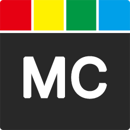
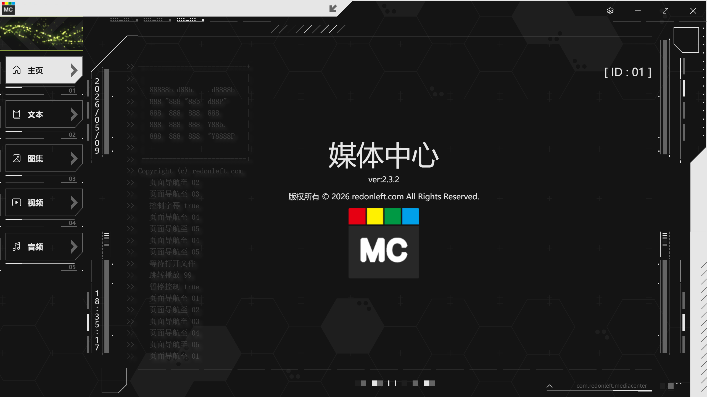
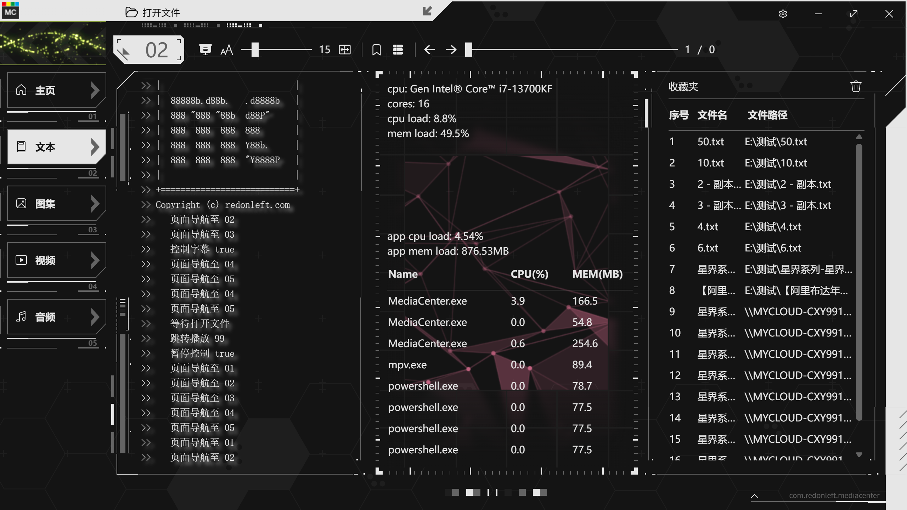
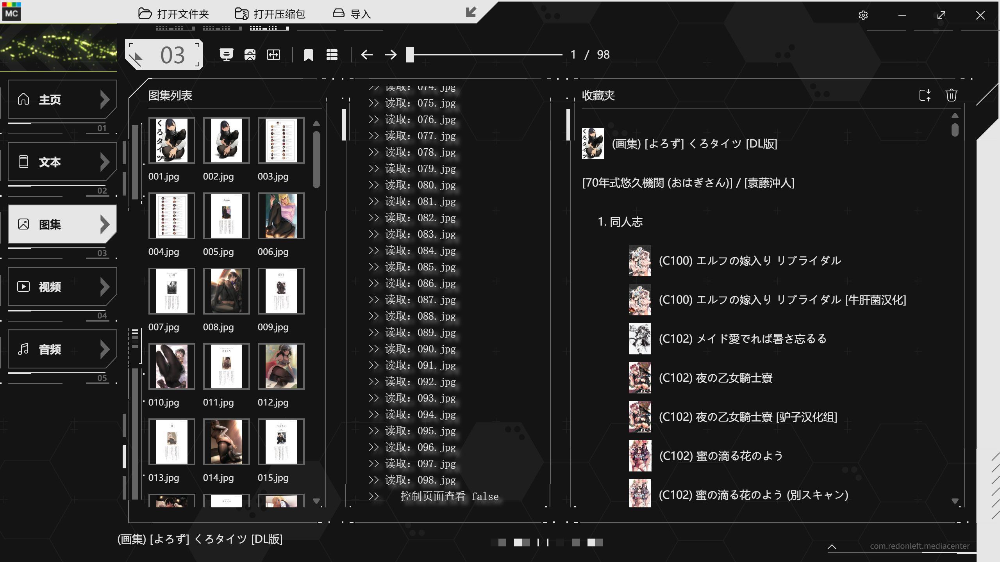
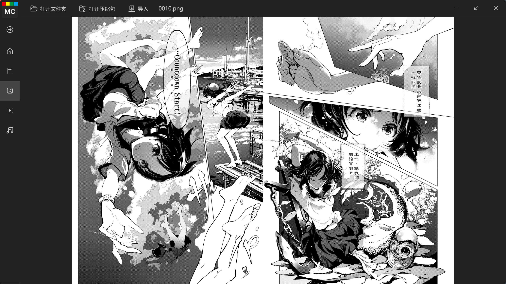
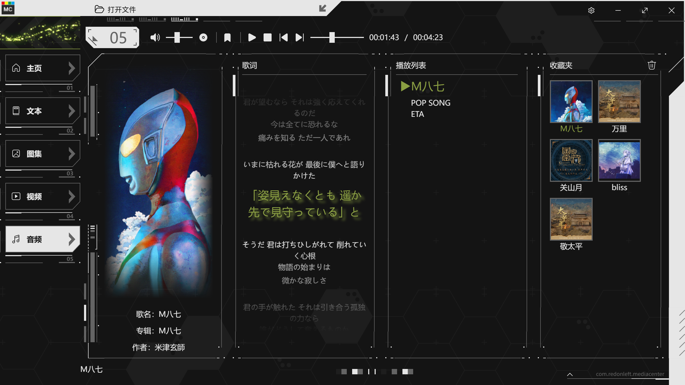

<p align="center">
  
</p>

<h1 align="center">MediaCenter</h1>

<p align="center">
    
    
</p>

<p align="center">
  
  
  
  
  
</p>

<p align="center">
  
  
  
  
  
</p>

An all-in-one multimedia reading platform. In plain terms, it integrates text, image gallery, video, and audio browsing and bookmarking into a single application.

## Before You Start

### It is NOT

A web browser — you cannot use it to browse internet resources.

A temporary file viewer — you cannot right-click a file and open it with this application.

### It IS

A tool for centrally browsing your collection scattered across local storage and LAN (NAS, other PCs, etc.).

This is a program I made for my own daily convenience, which means it reflects my personal usage style. It doesn't have flashy features either. So it may not be the right fit for you.

This program is currently in early development. Please do not use it as your primary tool. Future versions may delete or require you to delete existing configuration data.

Copyright © 2026 redonleft.com All Rights Reserved.

## Why Open

- Looking for collaborators interested in this project who can design cool UIs
- Can someone help me design an icon?
- There are definitely many bugs — please report them
- Feature requests are welcome — I'll do my best to implement them

## Requirements

- OS >= Windows 10

> **Since v2.0.0**, the following is no longer required (v1.x runs on Tauri 2 and depends on the system WebView):
>
> [WebView](https://developer.microsoft.com/en-us/microsoft-edge/webview2/) >= 140
>
> WebView is built into Windows 10/11 by default and usually doesn't need separate installation. If the version is too old, you can update it by installing or upgrading the [Edge](https://www.microsoft.com/en-us/edge) browser.

## Versioning
```
x.x.x
│ │ └─ Bug fixes
│ └─ Feature additions
└─ Framework or platform updates
```

## Privacy Statement

This is a standalone local application. I do not collect any of your information.

The program automatically generates local configuration files at:

C:\Users\YourUsername\AppData\Roaming\com.redonleft.mediacenter\

This folder stores program configuration, user bookmarks (including file paths, archive passwords, etc.), and image thumbnails.

## Usage Guide

There are five tabs, each corresponding to the type of file it handles based on its title.

Browsing files on the LAN requires that the LAN site is already mounted locally or authenticated, and can be accessed directly through the Windows browser.

The bookmark feature does not copy files — it only records file or folder paths.

### Home

Displays copyright information.


### Text

Open text files via "Open File".

PDF, EPUB, MOBI, archives, and other binary files are not supported.

The program does not rely on file extensions but automatically detects text encoding. See the following for details:

- [chardetng](https://docs.rs/chardetng/0.1.17/chardetng/)
- [encoding_rs](https://docs.rs/encoding_rs/0.8.35/encoding_rs/)

⚠ Bookmark: You can add the currently viewed file to the bookmark bar. Once added, you can open it directly from the bookmark bar.


### Image Gallery

Open a folder via "Open Folder" — the program automatically retrieves all image files in the folder to form a gallery.

Open an archive via "Open Archive" to retrieve all image files from local or LAN archives — the program automatically extracts all images to form a gallery.

The program does not rely on file extensions but automatically detects image encoding, supporting JPG, PNG, BMP, and GIF.

The program does not rely on extensions but automatically detects archive formats, supporting ZIP, RAR, and 7-Zip. During the process of opening an archive, you may be prompted to enter the archive password.

The design philosophy prioritizes image browsing speed, so all images in a folder are loaded at once. For archives, the entire archive is extracted to a temporary folder before reading all contents. This may result in slower loading for large archives.

⚠ Bookmark: Adds the currently opened folder or archive to bookmarks as a gallery bookmark.
```
comic/
├─ Author1/
│  ├─ GalleryA/
│  │  ├─ 001.png
│  │  ├─ 002.png
│  │  └─ ...
│  └─ GalleryB/
│     ├─ 001.png
│     ├─ 002.png
│     └─ ...
├─ Author2/
│  └─ GalleryC/
│     ├─ 001.png
│     ├─ 002.png
│     └─ ...
└─ GalleryD/
   ├─ 001.png
   ├─ 002.png
   └─ ...
```



### Video

Open video files via "Open File".

Based on the MPV player, which means it supports almost all video formats and automatically loads subtitle files with matching names located alongside the video.

- [MPV](https://mpv.io/) — A free and open-source media player

After loading a video, the program automatically collects all video files in the same folder that are numerically related to the currently opened video and forms a playlist.

Numerical relation refers to patterns like aaaa.s01e01.bbbb.cccc.mp4, aaaa.s01e02.bbbb.cccc.mp4, etc.

Use "Open Subtitle" to manually load additional subtitle files. All mainstream subtitle formats are supported.

⚠ Bookmark: Adds all related files in the current video's folder to bookmarks as a video series bookmark.

In other words, even within the same folder, files without a naming relationship will not be included in the current video series bookmark.

### Audio

Two operation modes, switchable via buttons.

1. Album Mode

Open an audio file via "Open File". Also based on the MPV player, supporting almost all audio formats. After loading an audio file, all other audio files in the same folder are retrieved as an album playlist. You can click directly on the album list to switch songs.

The program automatically retrieves audio file metadata to obtain cover art, song name, album, artist, and other information. It also automatically loads matching lyric files from the same folder. If no lyric file is found, it searches for lyrics on NetEase servers based on metadata. (Planning to switch to Spotify servers for lyric retrieval in the future.)

⚠ In album mode, the playlist consists of all audio files in the current album.

2. Favorites Mode — Recommended

⚠ Bookmark: Select and play your favorite tracks, then add them to bookmarks.

⚠ In favorites mode, the playlist consists of songs in your bookmarks.

You can of course play unbookmarked songs from the album in favorites mode, but after they finish, the player will automatically continue with your bookmarked songs. Similarly, in album mode, when you play a bookmarked song, the player will automatically continue with the rest of that album.

